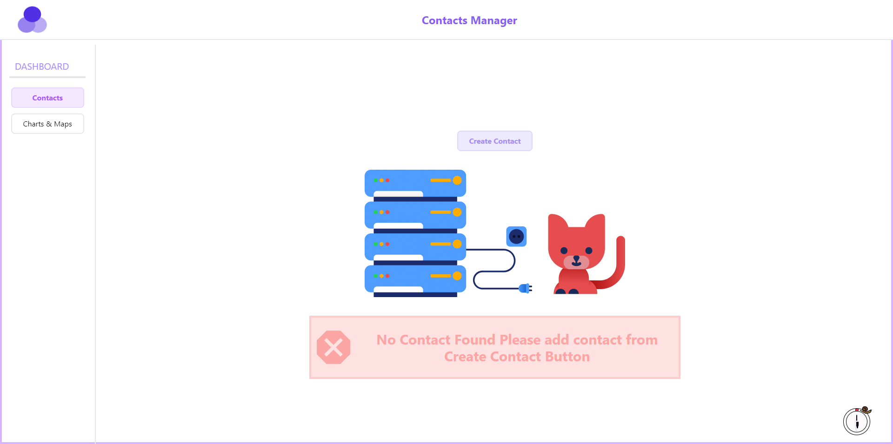
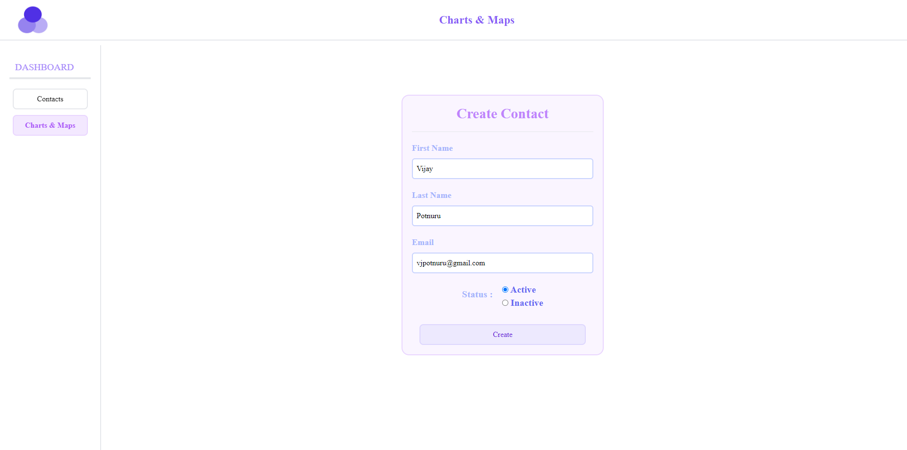
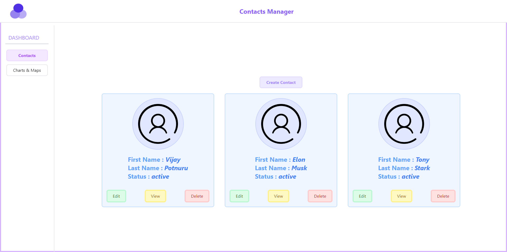
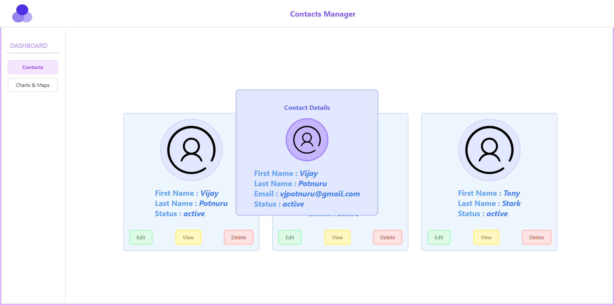
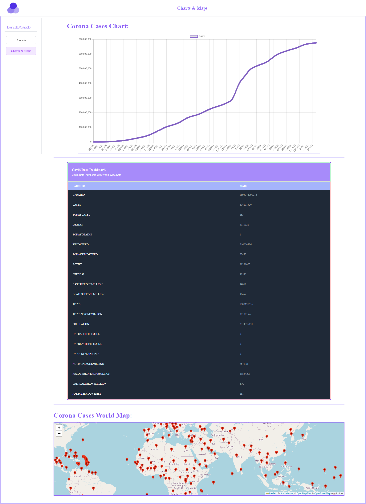

# Contact Management App with Charts and Maps
This app was built using ReactJS, TypeScript, TailwindCSS, React Router v6, Redux, Chartjs/React-Chartjs, React-Query/TanStack-Query, and React-Leaflet. It includes a Contacts section to manage contacts and a dashboard displaying COVID-19 data for different countries through charts and maps.

## **_Website_**: [https://contacts-manager-dashboard.netlify.app](https://contacts-manager-dashboard.netlify.app)🔗 

# Page and its Functionality
## The application consists of two primary pages:

# Contacts
This page enables you to manage your contacts. You can add new contacts by filling out the form, and the contact will be added to the list. You can also edit or delete existing contacts. Clicking on a View Button will display you to the contact details popup.

# Charts and Maps
This page presents COVID-19 data for different countries, including a line graph that displays case fluctuations over time and a map with markers that indicate the country name, total number of active, recovered cases, and deaths in that particular country as a popup.

# Technologies Used
## This app was built using the following technologies:

- ReactJS
- TypeScript
- TailwindCSS
- Redux
- React Router v6
- React-Query/TanStack-Query
- React-Leaflet
- Chartjs/React-Chartjs

# APIs Utilized
To retrieve data, the app utilizes the following APIs:

- World wide data of cases: https://disease.sh/v3/covid-19/all
- Country Specific data of cases: https://disease.sh/v3/covid-19/countries
- Graph data for cases with date: https://disease.sh/v3/covid-19/historical/all?lastdays=all

# Guide for Installing and Setting Up
## Here are the steps to follow in order to run this app:

- Clone this Repository:

   `git clone https://github.com/vijaypotnuru/Contact-Management-App`
- Install the dependencies by using this command:

  ### `npm install`
- Run the App:
   ### `npm start`
- The application will launch on your default browser at:
  ### http://localhost:3000/

# Screenshots 

## Contact Page :-

 

 

 

 

## Charts And Maps Page :-

